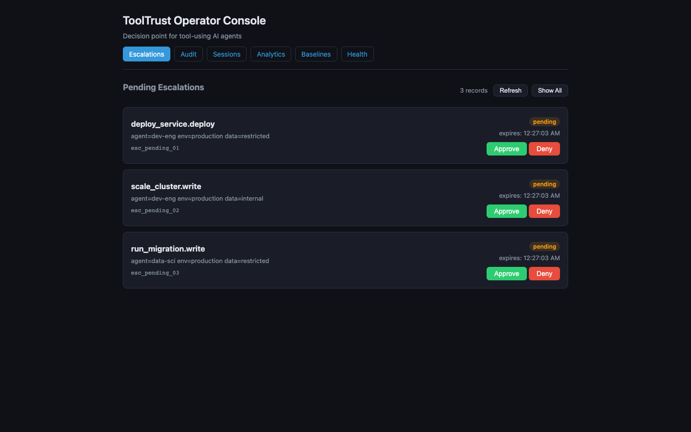
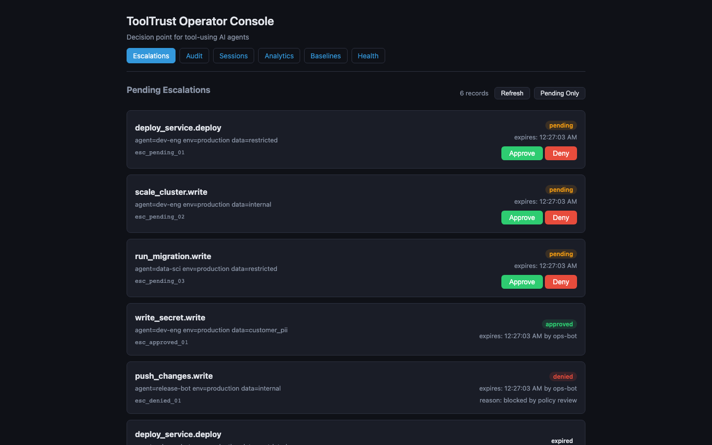
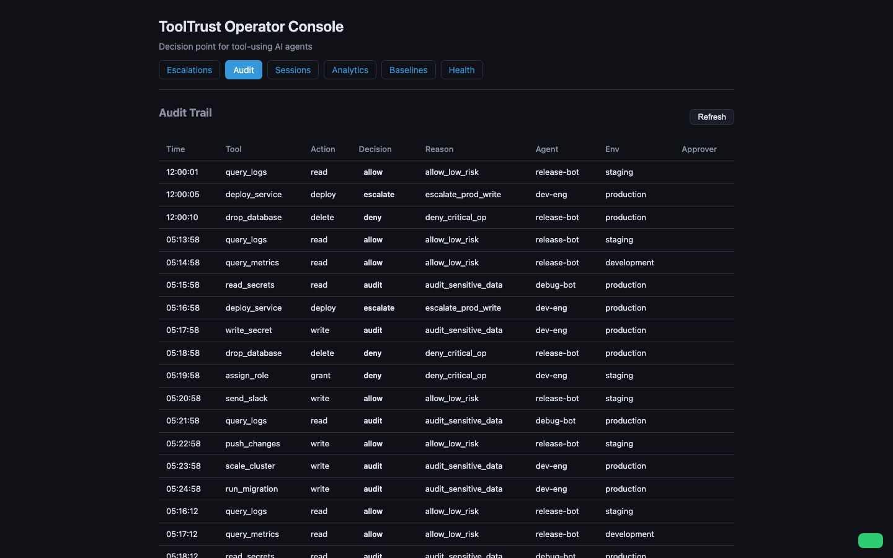
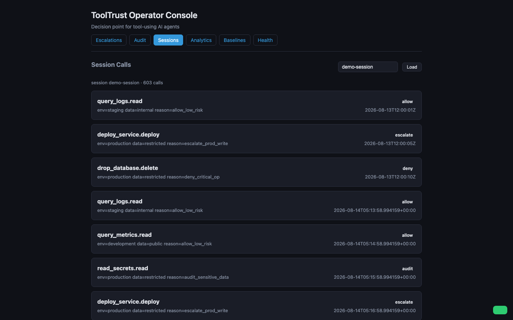
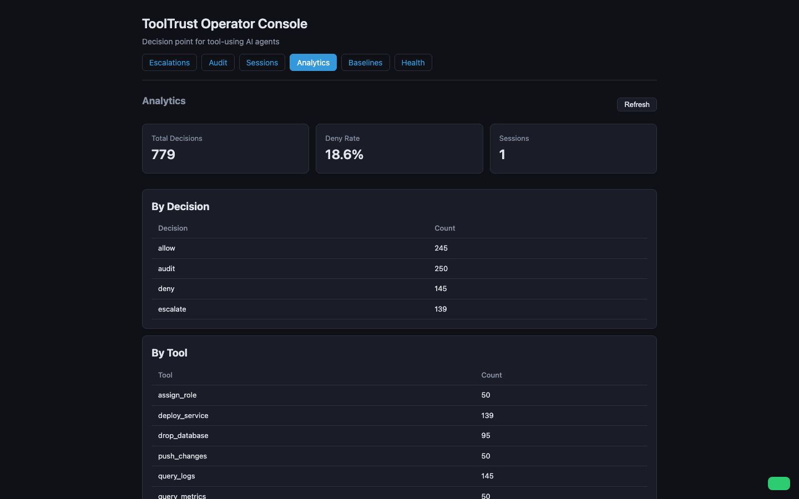
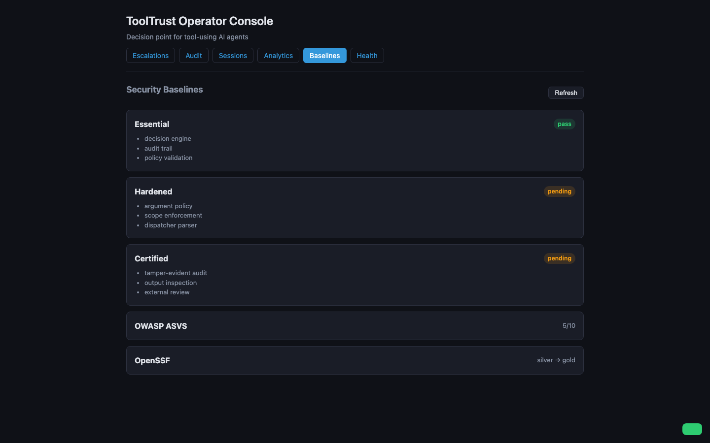
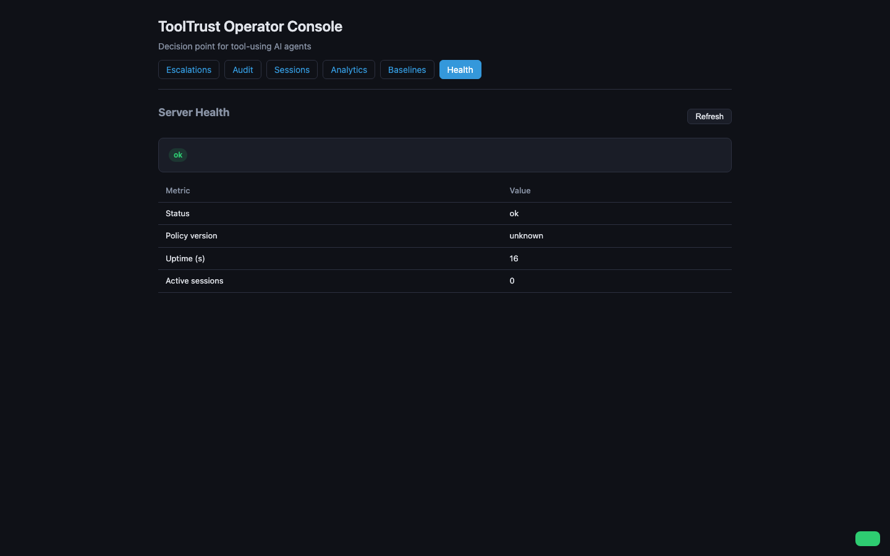

# Quickstart Guide

> **Agent ToolTrust** — a contextual risk and permission engine for tool-using
> AI agents. Every tool call is scored, decided, explained, and audited
> *before* it executes: **allow**, **audit**, **escalate** (human approval),
> or **deny**.

This guide walks from `pip install` to a running operator console with seeded
demo data in under 10 minutes. Every screenshot is from a real container run.

---

## 1. Install

```bash
pip install agent-tooltrust
```

Or with [uv](https://docs.astral.sh/uv/):

```bash
uv pip install agent-tooltrust
```

Verify:

```bash
tooltrust --version
```

---

## 2. Initialize a Policy

```bash
tooltrust init --posture balanced
```

This creates `tooltrust.yaml` in the current directory — a commented policy
file based on the **balanced** posture preset. Three presets ship out of the
box:

| Posture | Behavior |
|---------|----------|
| **balanced** (default) | Audited reads; staging writes allowed; prod writes escalate; destructive ops denied |
| **strict** | Deny-by-default; writes always escalate; unknown tools denied |
| **permissive** | Only the most destructive operations blocked |

The policy is plain YAML — override what you need and validate it:

```bash
tooltrust check          # validate against the schema
tooltrust diff           # compare against the posture default
```

---

## 3. Your First Decision

Evaluate a tool call from the CLI:

```bash
tooltrust evaluate \
  --tool query_logs \
  --action read \
  --env staging \
  --data internal \
  --agent debug-bot
```

```
  Decision      ✓ ALLOW
  Criticality   low
  Reason code   allow_low_risk
  Explanation   query_logs (read) in staging on internal data is within
                the allow band. Proceeding.
  Factors
    data_sensitivity     internal             contribution=0.20
    tool_category        search               contribution=0.10
    environment          staging              contribution=0.10
    action_class         read                 contribution=0.00
    agent_class          general              contribution=0.10
```

Try a riskier call and watch the decision change:

```bash
tooltrust evaluate \
  --tool drop_database \
  --action delete \
  --env production \
  --data restricted \
  --agent release-bot
# → ✗ DENY  (deny_critical_op)
```

---

## 4. Programmatic Integration

Embed ToolTrust in your agent loop in ~10 lines:

```python
from agent_tooltrust import Engine
from agent_tooltrust.policy.models import default_policy

engine = Engine(default_policy("balanced"))

result = engine.evaluate(
    tool_name="deploy_service",
    action="deploy",
    environment="production",
    data_class="restricted",
    agent_id="dev-eng",
)

print(result.decision)     # "escalate"
print(result.reason_code)  # "escalate_prod_write"
print(result.explanation)  # "Write action (deploy) in production..."
```

The engine returns one of five outcomes:

| Decision | Meaning |
|----------|---------|
| `allow` | Risk below threshold — proceed |
| `audit` | Sensitive read — proceed with enhanced logging |
| `escalate` | Requires human approval (returns an `escalation_id`) |
| `deny` | Blocked by policy rule or fail-closed |
| `allow_with_obligation` | Allowed, but a gatekeeper side-effect fires (sign-off, notify, signed audit) |

### Framework adapters

ToolTrust ships adapters for 8+ agent frameworks — the guard wraps the
tool-call boundary so no call bypasses policy:

```python
from agent_tooltrust.adapters.langgraph import ToolTrustGuard

guard = ToolTrustGuard(engine)
# pass `guard` into your LangGraph / PydanticAI / CrewAI / OpenAI agent loop
```

Supported: LangGraph, PydanticAI, OpenAI Agents SDK, CrewAI, AutoGen,
LlamaIndex, SmolAgents, Google ADK, raw Python `@engine.guard`, and an MCP
server wrapper.

---

## 5. Human-in-the-Loop Escalation

When a call escalates, the engine returns an `escalation_id` bound to the
exact action identity (a hash of tool + action + arguments). A human reviews
and approves or denies it — from the CLI or the web console.

### CLI round-trip

```bash
# An escalated call creates a pending escalation
tooltrust evaluate --tool deploy_service --action deploy --env production --data restricted --agent dev-eng
# → ⤴ ESCALATE  (escalation_id: esc_a1b2c3d4...)

# List pending escalations
tooltrust escalation list

# Approve (records approver + timestamp)
tooltrust escalation approve esc_a1b2c3d4 --approver alice@example.com

# Deny with a reason
tooltrust escalation deny esc_a1b2c3d4 --approver bob@example.com --reason "not approved for prod"
```

Approvals are **action-identity-bound**: the same `escalation_id` cannot be
reused for a different tool/action/argument set. An expired approval
(default TTL: 5 minutes) is treated as a deny.

---

## 6. Operator Console (Web Dashboard)

The fastest way to see ToolTrust in action is the Docker-hosted operator
console — a single-page dashboard with six views.

### Start the console

```bash
docker compose up --detach --force-recreate --wait
```

Open **http://localhost:9000/dashboard** in your browser.

### Seed demo data

The console ships with a deterministic demo dataset so every view shows
meaningful content:

```bash
curl -X POST http://localhost:9000/api/seed
# → {"status":"seeded","audit":12,"escalations":6}
```

### Escalations — approve or deny from the browser

The **Escalations** tab lists pending approval requests with one-click
**Approve** / **Deny** buttons. Each card shows the tool, action, agent,
environment, data class, and TTL countdown.



Toggle **Show All** to see every lifecycle state — pending, approved, denied,
and expired (TTL elapsed):



### Audit trail

The **Audit** tab renders every recorded decision as a filterable table with
color-coded decision badges (green = allow, amber = audit, blue = escalate,
red = deny). Every call — allow or deny — is logged with its reason code,
policy version, and approver (if escalated).



### Session replay

The **Sessions** tab reconstructs a session's decision chain from the audit
log — the ordered sequence of calls, each decision, and cumulative risk. Enter
a session id (e.g. `demo-session` after seeding) to load the timeline.



### Analytics

The **Analytics** tab aggregates the audit trail into decision distribution,
deny rate, per-tool counts, top denied tools, and session activity — a
policy-health overview at a glance.



### Security baselines

The **Baselines** tab shows the compliance posture across three tiers
(Essential / Hardened / Certified), the OWASP Agentic Top 10 coverage, and
the OpenSSF badge status.



### Server health

The **Health** tab shows the server status, policy version, uptime, and
active session count.



---

## 7. Other CLI Commands

```bash
# Explain why a decision was made (factor breakdown)
tooltrust explain --tool deploy_service --action write --env production --data restricted --agent release-bot

# Output as JSON (for scripting / CI)
tooltrust evaluate --tool query_logs --action read --env staging --data internal --agent debug-bot --format json

# Validate a policy file
tooltrust check path/to/tooltrust.yaml

# Compare against the posture default (migration check)
tooltrust check --migrate

# Scan a tool definition for adversarial patterns
tooltrust scan --name "my_tool" --desc "Reads customer data"

# Run golden fixtures as CI regression
tooltrust test --fixtures tests/fixtures/acceptance_matrix.yaml

# Query / export the audit trail
tooltrust audit show --session <id>
tooltrust audit query --decision deny

# Start the MCP server (SSE transport)
tooltrust serve --port 8000

# Full help
tooltrust --help
```

---

## 8. What's Next

- **[API reference](api.md)** — every endpoint, decision type, and reason code
- **[Architecture](../architecture/architecture-v0.2.0.md)** — the five-stage
  pipeline and design decisions
- **[Policy packs](../../packs/README.md)** — share and validate community
  tool policies
- **[Security baseline](../SECURITY_BASELINE.md)** — OWASP Agentic Top 10
  coverage and hardening tiers
- **[UI test plan](../test/web-ui-test-plan.md)** — the Playwright E2E matrix
  and screenshot pipeline

---

> **Screenshots** in this guide are generated by the Playwright suite
> (`tests/ui/test_dashboard_e2e.py`) at a fixed 1440×900 viewport against the
> seeded Docker container. Regenerate them with:
>
> ```bash
> docker compose up --detach --force-recreate --wait
> uv run pytest tests/ui -v --tb=short
> ```
>
> Output lands in [`screenshots/`](screenshots/) — see
> [`screenshots/README.md`](screenshots/README.md) for the file map.
